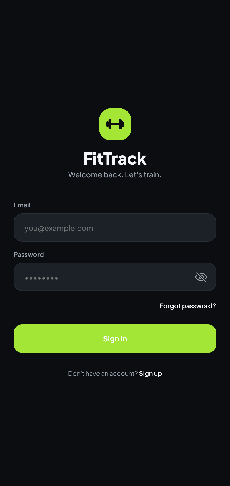
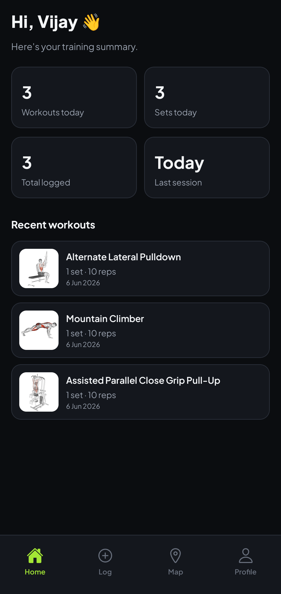
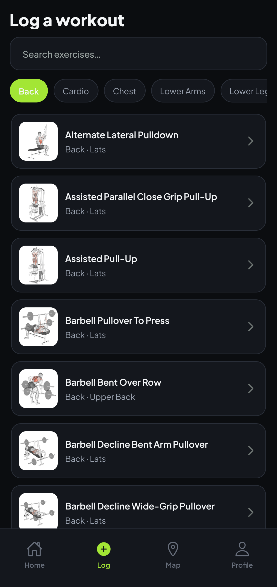
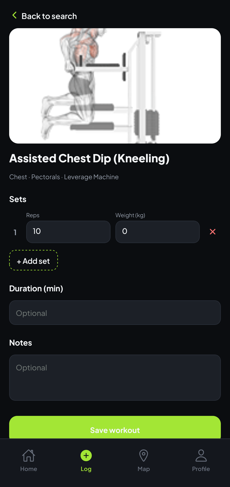
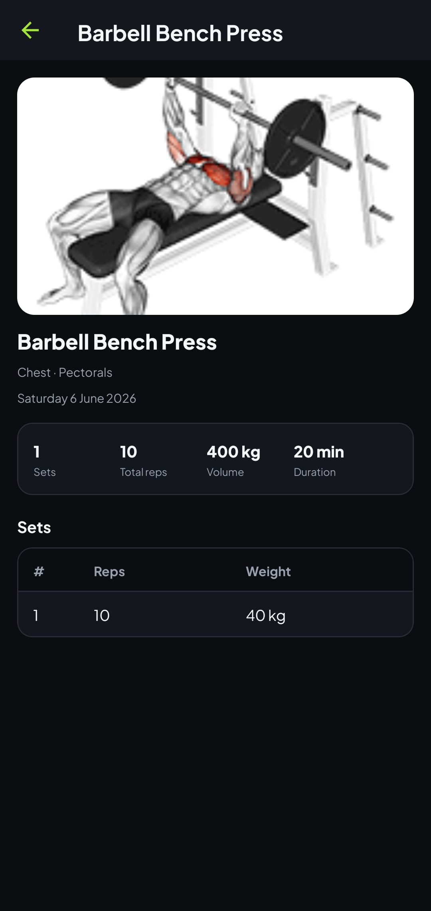
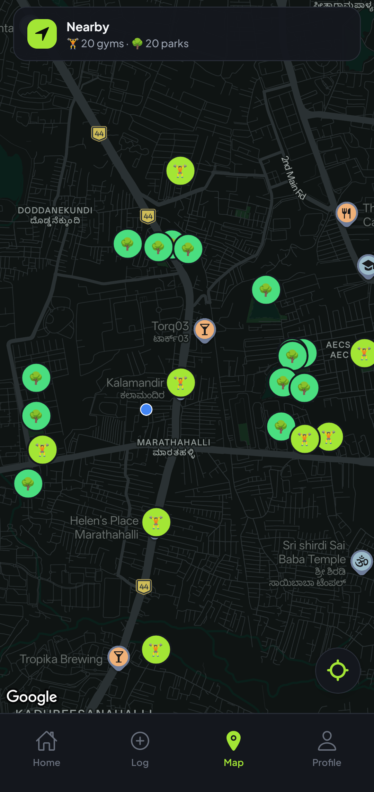
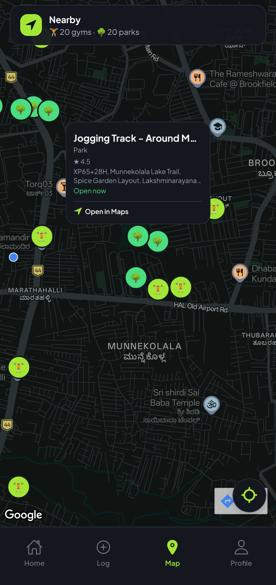
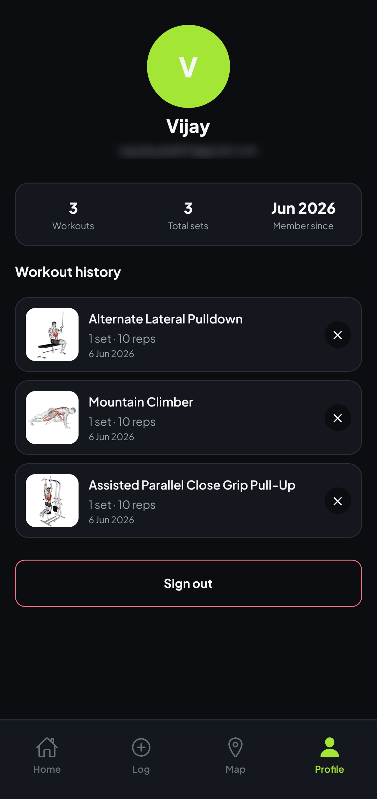

# FitTrack

A dark-themed fitness companion for logging workouts, browsing a full exercise
library, and discovering nearby gyms and parks. Built with Expo and React
Native.

## Screenshots

<p align="center">
  
  
  
  
</p>
<p align="center">
  
  
  
  
</p>

> Screenshots live in [`assets/screenshots/`](assets/screenshots/) — see the
> note there for the expected filenames and how to capture them.

## Features

- **Email/password auth** — sign up, sign in, and password reset via Firebase Auth.
- **Workout logging** — search a large exercise database, add sets/reps/weight,
  duration, and notes, then save to your history.
- **Exercise library** — browse by name or body part with animated demo GIFs.
- **Dashboard** — daily summary stats and your most recent sessions at a glance.
- **Nearby places** — a dark-styled map of gyms and parks around you (Google
  Places); tap a marker to open it in your Maps app.
- **History & profile** — full workout history with delete, plus account stats.
- **Offline-friendly** — your workouts are cached locally and shown instantly,
  even without a connection; an indicator appears when you're offline and
  changes sync once you reconnect.
- **Polished UX** — custom animated splash, skeleton loaders, themed dialogs,
  show/hide password, and keyboard-aware forms.

## Tech stack

| Area        | Technology                                                   |
| ----------- | ------------------------------------------------------------ |
| Framework   | [Expo](https://expo.dev) SDK 56, React Native 0.85, React 19 |
| Language    | TypeScript                                                   |
| Navigation  | Expo Router (typed routes)                                   |
| Styling     | NativeWind (Tailwind CSS) + a custom dark theme              |
| Typography  | Plus Jakarta Sans (`@expo-google-fonts`)                     |
| Animation   | React Native Reanimated                                      |
| Auth & data | Firebase Auth + Cloud Firestore                              |
| Local cache | AsyncStorage                                                 |
| Maps        | `react-native-maps` + Google Places API                      |
| Exercises   | ExerciseDB (RapidAPI)                                        |
| Icons       | `@expo/vector-icons` (Ionicons)                              |

## Getting started

```bash
npm install
cp .env.example .env   # fill in the keys below
npx expo run:android   # or: npx expo run:ios
```

### Environment variables

Set these in `.env` (see `.env.example`):

- `EXPO_PUBLIC_FIREBASE_*` — Firebase project config (apiKey, authDomain,
  projectId, storageBucket, messagingSenderId, appId)
- `EXPO_PUBLIC_GOOGLE_MAPS_API_KEY` — Google Maps SDK + Places API key
- `EXPO_PUBLIC_EXERCISEDB_API_KEY` / `EXPO_PUBLIC_EXERCISEDB_API_HOST` — RapidAPI
  ExerciseDB credentials

> The Google Maps key is consumed both at runtime (Places REST) and baked into
> the native build via `app.config.ts`. Changing it requires a rebuild.

## Project structure

```
src/
  app/            Expo Router routes (auth, tabs, workout detail)
  components/     Reusable UI (cards, markers, splash) and ui/ primitives
  context/        Auth, Workout, and Dialog providers
  hooks/          useExerciseSearch, useLocation, useWorkouts
  services/       Firebase, Firestore, Maps, and ExerciseDB clients
  constants/      Theme tokens and API config
  types/          Shared TypeScript interfaces
```

## Scripts

- `npx expo start -c` — start the dev server with a cleared cache
- `node scripts/gen-icons.mjs` — regenerate the app icon set from SVG
- `npx tsc --noEmit` — type-check

## License

[MIT](LICENSE) © Vijay Diyyala
